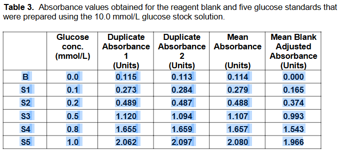
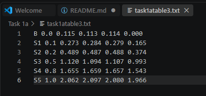

# MLS211 Assignment Task Data Importer

## Requirements

This script assumes you have python 3 installed on your computer.

Using Microsoft Visual Studio Code or similar IDE will also make it easier to 
run the script. If you want to use the Jupyter Notebook then the Positron
(https://positron.posit.co/) IDE by Posit is highly recommended.

## Installation

Extract the mls211task1a.zip file to a suitable directory and open this directory 
with vscode.

From the command prompt in this directory create a virtual environment with:

```
python -m venv .venv
```

Open a terminal window and activate the virtual environment.

Windows
```
.venv\Scripts\activate
```

Linux (and may be Mac)
```
source .venv/bin/activate
```

Install the required dependencies (numpy and openpyxl) with:

```
pip install -r requirements.txt
```

If you prefer to run the jupyter notebook from the commandline instead
of using an IDE such as vscode then install the jupyter package and
run the notebook with:

```
pip install jupyter
jupyter notebook mlsrpt.ipynb
```

## Usage

### Copy data from PDF using mls211.py

Assuming the student has submitted a PDF, highlight all the rows and columns
containing data as shown in Figure 1.



Open the file task1atable3.txt.

Clear any existing data.

Paste the values to the text file.



Run the mls211.py script from within the activated virtual environment

```
python mls211.py
```

### Copy data from PDF using task1a.ipynb Jupyter Notebook

Open the mlsrpt.ipynb file using Positron

Assuming the student has submitted a PDF, highlight all the rows and columns
containing data as shown in Figure 1.


Replace the input_text with the data from the copied cells.

Sequentially run each code section of the notebook.
