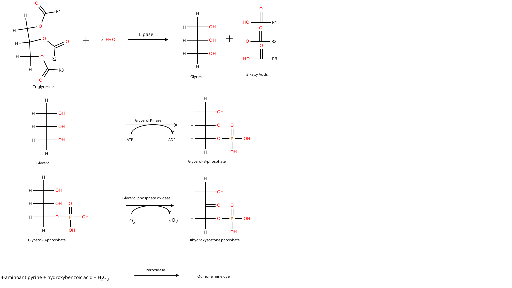

# MLS211 Task 1B Exercises

## Gestational Diabetes Mellitus (3 marks)

- 1 mark for correctly describing the changes to blood glucose and insulin sensitivity during pregnancy,
- 1 mark for describing a mechanism that contributes to this phenomenon, 
- 0.5 marks for grammar, spelling and presentation,
- 0.5 marks for appropriate selection of supporting references

Normal pregnancy associated with insulin resistance (insulin action reduced by 50-70%) associated with increased insulin secretion (65% increase in basal insulin and c-peptide secretion with advancing gestation). (Catalano 1998). Minimal reducation in glucose tolerance (Butte 2000). 

In GDM the compensatory increase in insulin secretion is impaired.

- Insulin resistance
    - tissue specific reduction in insulin receptor (IR) phosphorylation.
    - decreased expression of insulin receptor substrate 1 (IRS-1) in skeletal muscle
    - changes in degree of serine and tyrosine phosphorylation of IR and IRS-1 further inhibiting insulin signalling.
    - higher circulating free fatty acids
    - reduced peroxisome proliferator-activated receptor (PPAR) expression in adipose tissue.
    - reduced number of GLUT-4 glucose transporters in adiposites and abnormal translocation of transporters to the cell surface
- Impaired insulin secretion
- Increased hepatic glucose production

## Haemoglobin A1c (3 marks)

- 0.5 marks for outlining why glycated haemoglobin is selected to assess diabetic control,
- 0.5 marks for outlining how glycated haemoglobin is formed,
- 1.0 mark for two (2) limitations of glycated haemoglobin, 
- 0.5 marks for grammar, spelling and presentation,
- 0.5 marks for appropriate selection of supporting references

- Why glycated haemoglobin
    - glycation of proteins
    - half-life of RBC
    - HbA1c definition
- Formation of glycated Hb
    - Schiff base
    - Amadori rearrangement
- Limitations
    - Altered red cell half life 
        - increased: Iron deficiency
        - decreased: Abnormal Hb (Thalassemia)
    - Presence of abnormal haemoglobins

## Buffer solution (4 marks)

**KH2PO4**

The pH of a phosphate buffer prepared with 16.81 g of $\text{KH}_2\text{PO}_4$ and 20.89 g of $\text{K}_2\text{HPO}_4$ is approximately **7.20**.

### Calculation Steps
1. **Find the moles of each component**:
   * Molar mass of $\text{KH}_2\text{PO}_4$ (acid, $\text{H}_2\text{PO}_4^-$) $\approx 136.09\text{ g/mol}$ $\rightarrow \frac{16.81\text{ g}}{136.09\text{ g/mol}} \approx 0.1235\text{ mol}$
   * Molar mass of $\text{K}_2\text{HPO}_4$ (base, $\text{HPO}_4^{2-}$) $\approx 174.18\text{ g/mol}$ $\rightarrow \frac{20.89\text{ g}}{174.18\text{ g/mol}} \approx 0.1199\text{ mol}$

2. **Apply the Henderson-Hasselbalch equation**:
   $$\text{pH} = \text{p}K_{\text{a2}} + \log\left(\frac{[\text{A}^-]}{[\text{HA}]}\right)$$
   Using the standard second dissociation constant for phosphoric acid ($\text{p}K_{\text{a2}} \approx 7.21$):
   $$\text{pH} = 7.21 + \log\left(\frac{0.1199}{0.1235}\right) = 7.21 + (-0.013) \approx 7.20$$
   *(Note: Actual pH can vary slightly depending on the final total volume/concentration and resulting ionic strength of the solution).*

- 1 mark for correctly calculating the moles of the conjugate base and the conjugate acid,
- 1 mark for correctly calculating the molarity of each compound in solution,
- 1 mark for correctly applying the Henderson-Hasselback equation,
- 0.5 marks for outlining whether the solution was correctly prepared,
- 0.5 marks for correct units and appropriately referencing relevant formulas

## Lipid Profile

### Patient 1

Melanie is a 31-year-old Caucasian woman undergoing her second pregnancy. She has no
prior history of glucose intolerance and didn’t develop gestational diabetes mellitus (GDM)
during her first pregnancy. However, Melanie’s family history reveals that her mother has
Type 2 diabetes.

A random capillary blood sample collected from Melanie at her family doctor’s clinic at week
24 of gestation had a glucose concentration of 9.3 mmol/L. A urine test strip indicated +3 for
glucose and negative for ketones. A few days later, Melanie undertook a routine OGTT at a
diabetic clinic of a local hospital to test for GDM. Blood was collected from Melanie (median
cubital vein) by a phlebotomist into a GBO Vacuette fluoride/oxalate (grey top) collection tube
and centrifuged at room temperature at a speed of 1200 RCF for 10 minutes in a Beckman
swinging bucket centrifuge to obtain the plasma fraction

### Patient 2

David is a 46-year-old man who is moderately overweight (weight 85 kg), exercises
occasionally, and has mildly elevated blood pressure. Recently, David notices that he is feeling
more tired throughout the day and is going to the toilet more often at night. David consults
with his family doctor, who tests his urine to find evidence of mild glycosuria and
microalbuminuria, but no ketonuria. David’s fasting (basal) plasma glucose was elevated at 6.4
mmol/L, suggesting possible impaired fasting glucose.

The doctor requests that David attends a diabetic clinic at a local hospital for a OGTT. Two
blood samples were collected from David (median cubital vein) by a phlebotomist – the first a
fasting (pre-load) blood sample and the second a 2-hour post-load blood sample. Both blood
samples were collected into a GBO Vacuette fluoride/oxalate (grey top) collection tube and
centrifuged at room temperature at a speed of 1200 RCF for 10 minutes in a Beckman swinging
bucket centrifuge to obtain the plasma fraction

| ID  | Conc  |
|-----|-------|
| P1-F | 5.8 |
| P1-60 | 13.6 |
| P1-120 | 9.3 |
| P2-F | 7.5 |
| P2-120 | 11.5 |
| QC | 5.9 |

| ID | Chol | HDL-C | LDL-C | Trig |
|----|------|-------|-------|------|
| P1 |  8.5 |   2.2 |   5.2 |  2.4 |
| P2 |  5.9 |   NaN |   NaN |  1.9 |
| QC |  3.9 |   0.4 |   NaN |  1.0 |
| QC Range | 1.8 - 4.6 | 0.2 - 1.3 || 0.6 - 2.0 |

Lipid Reference Intervals

| | | Units |
|-------------------|-----------|--------|
| Total Cholesterol | $\le$ 5.5 | mmol/L |
| HDL Cholesterol (m) | $\ge$ 1.0 | mmol/L |
| HDL Cholesterol (f) | $\ge$ 1.2 | mmol/L |
| LDL Cholesterol | $\le$ 3.0 | mmol/L |
| Triglyceride | $\le$ 2.0 | mmol/L |

### Lipid Interpretation

- 0.5 marks for accurate discussion of the blood serum lipid profile for Patient 1 and use of the patient assessment information. 
- 0.5 marks for correct diagnosis of Patient 1, with correct reference ranges and appropriately referenced.
- 0.5 marks for accurate discussion of the blood serum lipid profile for Patient 2 and use of the patient assessment information.
- 0.5 marks for accurate diagnosis Patient 2, with correct reference ranges and appropriately referenced.
- 1 mark for integrating blood glucose testing results for Melanie and discussing lipid metabolism changes during pregnancy,
- 1 mark for integrating blood glucose testing results for David and calculating his cardiac risk profile using a validated tool.

#### Patient 1

Gestational Diabetes Mellitus

In a normal pregnancy, total cholesterol levels increase by approximately 50%, LDL-C by 30-40%, HDL-C by 25%, and TGs by 2- to 3-fold. (Wild 2026)

Overt diabetes in pregnancy (overt DIP) if one or more of: 
1. fasting plasma glucose (FPG)≥7.0mmol/L;
2. two‐hour plasma glucose (2hPG)≥11.1mmol/L following a 75g two‐hour pregnancy oral glucose tolerance test (POGTT); and/or
3. glycated haemoglobin (HbA1c)≥6.5% (≥48mmol/mol).

Gestational diabetes mellitus if one or more of the following during a 75g two‐hour POGTT:

1. FPG ≥5.3–6.9mmol/L;
2. one‐hour plasma glucose (1hPG)≥10.6 mmol/L;
3. 2hPG≥9.0–11.0mmol/L

#### Patient 2

Diabetes mellitus or impaired glucose tolerance

https://www.cvdcheck.org.au/calculator

## Triglyceride Method

- 1 mark Figure is well constructed, clear, well labelled and has a figure legend 
- 1 mark Enzyme 1 is identified, labelled correctly and in the correct placement of reaction with related chemical structures.
- 1 mark Enzyme 2 is identified, labelled correctly and in the correct placement of reaction with related chemical structures.
- 1 mark Enzyme 3 is identified, labelled correctly and in the correct placement of reaction with relate chemical structures.
- 1 mark Enzyme 4 is identified, labelled correctly and in the correct placement of reaction with related chemical structures.
- 1 mark Chemical reaction / question has been well-referenced, presented exceptionally and well researched

## References

Butte NF. Carbohydrate and lipid metabolism in pregnancy: normal compared with gestational diabetes mellitus. Am J Clin Nutr. 2000 May;71(5 Suppl):1256S-61S. doi: 10.1093/ajcn/71.5.1256s. PMID: 10799399.

Catalano PM, Drago NM, Amini SB. Longitudinal changes in pancreatic beta-cell function and metabolic clearance rate of insulin in pregnant women with normal and abnormal glucose tolerance. Diabetes Care. 1998 Mar;21(3):403-8. doi: 10.2337/diacare.21.3.403. Erratum in: Diabetes Care 1999 Jun;22(6):1013. PMID: 9540023.

Wild R, Feingold KR. Effect of Pregnancy on Lipid Metabolism and Lipoprotein Levels. [Updated 2026 Jan 31]. In: Feingold KR, Adler RA, Ahmed SF, et al., editors. Endotext [Internet]. South Dartmouth (MA): MDText.com, Inc.; 2000-. Available from: https://www.ncbi.nlm.nih.gov/books/NBK498654/

Sweeting A, Hare MJ, de Jersey SJ, Shub AL, Zinga J, Foged C, Hall RM, Wong T, Simmons D. Australasian Diabetes in Pregnancy Society (ADIPS) 2025 consensus recommendations for the screening, diagnosis and classification of gestational diabetes. Med J Aust. 2025 Aug 4;223(3):161-167. doi: 10.5694/mja2.52696
https://www.mja.com.au/journal/2025/223/3/australasian-diabetes-pregnancy-society-adips-2025-consensus-recommendations

- 1 mark Appropriate selection of a minimum of 5 appropriate references. References should be from academic sources, including textbooks and journal articles
- 0.5 mark References are presented in either Harvard or Vancouver style
- 0.5 mark References are present in-text and as a reference list (0.5 marks)

## Comments

More detail on how HbA1c reflects the average glucose concentration over the last 6 weeks. Perhaps contrasting with other markers of glycaemic control such as episodic glucose measurement, continuous glucose monitoring, or fructosamine. Importantly, HbA1c is a predictor of microvascular complications as shown in the landmark DCCT and UKPDS trials.

Good work for the laboratory exercises. Unfortunately, the clinical histories has been associated with the opposite patient's results for laboratory exercise 4.

Imbalance between insulin resistance and increased hepatic glucose output, with a compensatory increase in insulin production has been well described but I would like to see a more in depth discussion of the molecular mechanisms such as the IRS-1 signalling pathway and the translocation of GLUT-4 transporters.

As a consequence of the hormonal changes in the 2nd and 3rd trimesters of pregancy insulin resistance and increased hepatic glucose output occurs to support the needs of the developing foetus. In a normal pregnancy this is compensated for by an increase in insulin production by the maternal pancreas. In GDM the increase in insulin production is insufficient to compensate for the level of insulin resistance and hyperglycaemia ensures. A more detailed discussion about the molecular mechanisms leading to insulin resistance is also required.

Use of HbA1c as a diagnostic test is relatively recent. HbA1c is primarily used as a monitoring test as it is reflective of the average glucose concentration over a period of several weeks. As shown by the DCCT and UKPDS trials the HbA1c level is predictive of the risk of microvascular complications and so levels are used to guide patient management.

The target phosphate buffer in practical 2 was 0.5 M phosphate buffer at pH 7.0. 

The buffer was supposed to be made up to a total concentration of 0.5 mol/L and pH 7.0 (see lab manual). The total molar concentration of phosphate is ((0.1235+0.1199)/0.25) 0.974 mol/L which is almost double what it should be.

Good but also useful to calculate the molar concentration of phosphate as the prepared solution has a concentration of about 0.974 mol/L and the solution was intended to have a final concentration of 0.5 mol/L

Lipid results may have been transposed between patients. In practical 2 Melanie patient was patient 1 and David patient 2. However, in practical 3 David is patient 1 and Melanie is patient 2. Also, according to the patient information sheet for practical 3, Melanie is presenting 6 weeks post-partum.

Good discussion but also useful to note that the history of GDM places Melanie at increased risk of developing type II diabetes mellitus, and this should be checked periodically.

Patient information sheet for practical 3 also asks you to calculate David's absolute cardiovascular risk using an online calculator.

Good but also need to calculate the absolute CVD risk using an online calculator (eg https://www.cvdcheck.org.au/calculator) using the supplied clinical details and your laboratory results.

A very high LDL concentration should also lead to the consideration of familial hypercholesterolaemia.

Also note that Melanie's history of GDM places her at increased risk of developing type II diabetes mellitus, and this needs to be monitoried.

Better to represent the alkyl chains in triglyceride as R1, R2, and R3 as these can very in length and saturation.

Quinoneimines are a class of molecules. The quinoneimine from PubChem is unlikely to be the quinoneimine formed in this reaction (it has too many carbon atoms)

This is unlikely to be the quinoneimine formed in your assay. Note the stoichiometry of reaction does not balance. There are more carbon and oxygen atoms on the right hand side of the reaction than the left hand side
